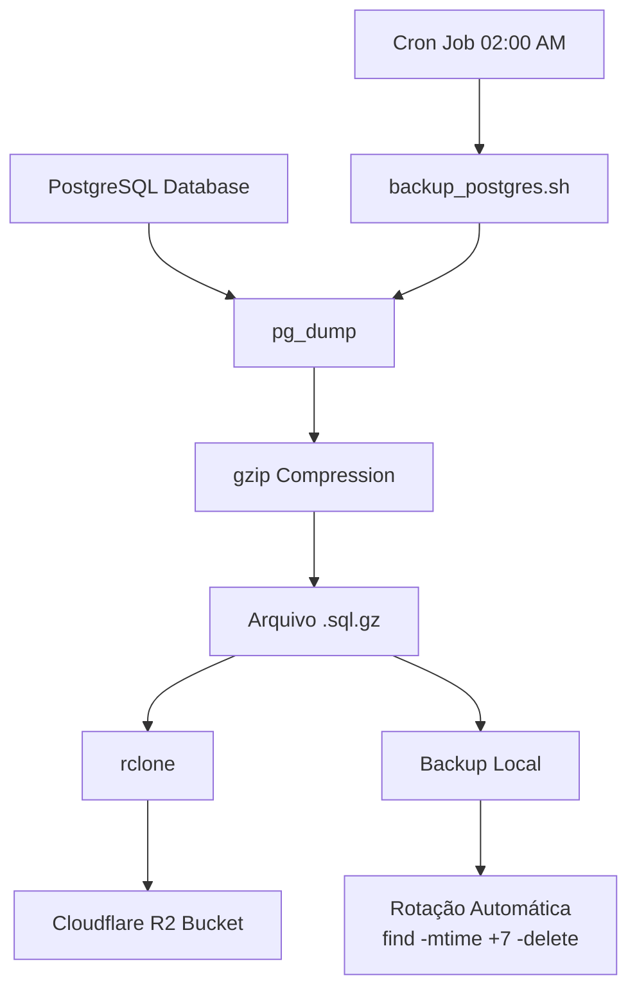

# PostgreSQL Backup Automation with Cloudflare R2

Guia prático para configurar backups automáticos do PostgreSQL em servidores Linux utilizando Bash, `pg_dump`, `gzip`, `rclone` e Cloudflare R2.

Este tutorial foi criado com base em uma implementação real utilizada em ambiente de produção, com foco em automação.

---

# Objetivo

Automatizar:

- geração de backups PostgreSQL;
- compactação dos arquivos;
- envio automático para Cloudflare R2;
- limpeza de backups antigos;
- execução diária via `cron`.

---

# Tecnologias Utilizadas

- Bash Script
- PostgreSQL (`pg_dump`)
- `gzip`
- `rclone`
- Cloudflare R2
- Linux / Ubuntu
- Cron

---
# Fluxo da Automação



---
# Configure o rclone
O rclone é um programa de linha de comando para gerenciar arquivos em armazenamento na nuvem. No exemplo abaixo, após configura-lo, utilizaremos o rclone para enviar os arquivos de backup para o Cloudflare R2.

## Instale o rclone
```bash
sudo apt install rclone
```

## Configure o rclone
```bash
rclone config
```

# Crie sua pasta de backups
```bash
mkdir backups/postgres
```
# Estrutura do Script de Backup
## Tratamento de falhas

O script utiliza:
- `set -e` → interrompe o script caso algum comando falhe;
- `set -o pipefail` → detecta falhas em comandos encadeados com pipes.

```bash
#!/bin/bash

set -o pipefail
set -e

DATA=$(date +"%Y-%m-%d_%H-%M")
BACKUP_DIR="/home/backups/postgres"
DB_NAME="DB_NAME"
DB_USER="DB_USER"

export PGPASSWORD="DB_PASSWORD"

mkdir -p $BACKUP_DIR

pg_dump -U $DB_USER $DB_NAME | gzip > $BACKUP_DIR/backup_${DB_NAME}_${DATA}.sql.gz

if [ $? -eq 0 ]; then
        echo "Backup realizado com sucesso"

        /usr/bin/rclone copy \
        "$BACKUP_DIR/backup_${DB_NAME}_${DATA}.sql.gz" \
        cloudflare:postgres-backups-staging

        echo "Upload realizado com sucesso"
else 
        echo "Erro ao realizar backup"
fi

find $BACKUP_DIR -type f -name "*.gz" -mtime +7 -delete

```

# Configurando o CRON

## Crie o diretório de logs

```bash
mkdir -p /home/logs
```

## Abra o editor do CRON

```bash
crontab -e
```

## Adicione a execução automática do backup

```bash
0 2 * * * /home/backups/backup_postgres.sh >> /home/logs/backup.log 2>&1
```

O comando acima executa o script diariamente às 02:00 da manhã e salva os logs em `/home/logs/backup.log`.

## Visualize o CRON criado
```bash
crontab -l
```